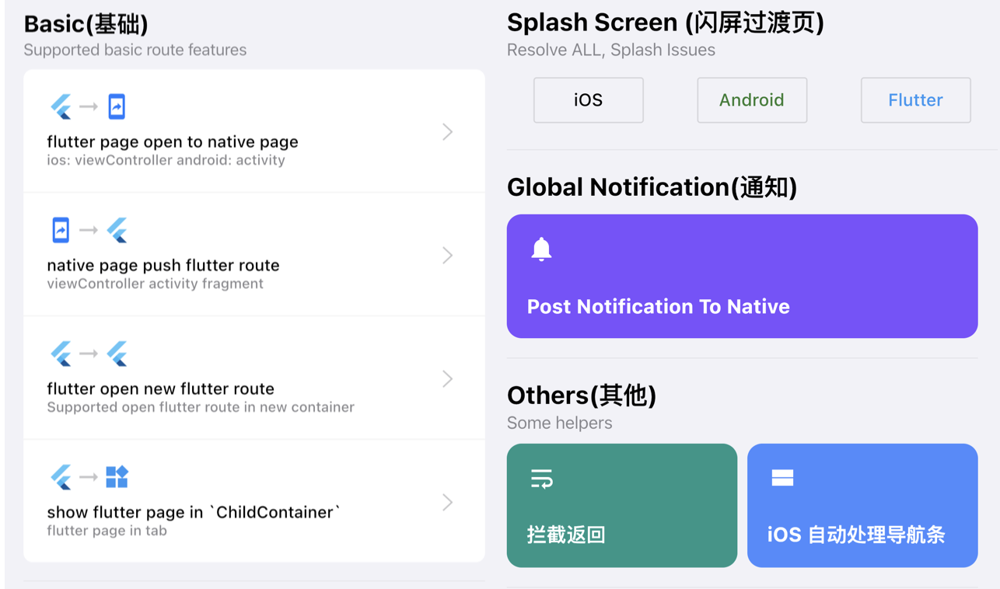

#   Faraday [中文文档](./README.md)


![pub_Version](https://img.shields.io/pub/v/g_faraday?include_prereleases&style=for-the-badge&logo=data:image/svg+xml;base64,PD94bWwgdmVyc2lvbj0iMS4wIiBlbmNvZGluZz0iVVRGLTgiPz4KPHN2ZyB3aWR0aD0iNjAwcHgiIGhlaWdodD0iNjAwcHgiIHZpZXdCb3g9IjAgMCA2MDAgNjAwIiB2ZXJzaW9uPSIxLjEiIHhtbG5zPSJodHRwOi8vd3d3LnczLm9yZy8yMDAwL3N2ZyIgeG1sbnM6eGxpbms9Imh0dHA6Ly93d3cudzMub3JnLzE5OTkveGxpbmsiPgogICAgPHRpdGxlPmZhcmFkYXk8L3RpdGxlPgogICAgPGRlZnM+CiAgICAgICAgPGxpbmVhckdyYWRpZW50IHgxPSIxMC42ODAxNzA0JSIgeTE9IjI2Ljk5MzAyODclIiB4Mj0iNzIuMTEzMDU3NiUiIHkyPSI1Mi45MTkyNjU3JSIgaWQ9ImxpbmVhckdyYWRpZW50LTEiPgogICAgICAgICAgICA8c3RvcCBzdG9wLWNvbG9yPSIjMDAwMDAwIiBvZmZzZXQ9IjAlIj48L3N0b3A+CiAgICAgICAgICAgIDxzdG9wIHN0b3AtY29sb3I9IiMwMDAwMDAiIHN0b3Atb3BhY2l0eT0iMCIgb2Zmc2V0PSIxMDAlIj48L3N0b3A+CiAgICAgICAgPC9saW5lYXJHcmFkaWVudD4KICAgIDwvZGVmcz4KICAgIDxnIGlkPSJQYWdlLTEiIHN0cm9rZT0ibm9uZSIgc3Ryb2tlLXdpZHRoPSIxIiBmaWxsPSJub25lIiBmaWxsLXJ1bGU9ImV2ZW5vZGQiPgogICAgICAgIDxnIGlkPSJmYXJhZGF5IiBmaWxsLXJ1bGU9Im5vbnplcm8iPgogICAgICAgICAgICA8ZyBpZD0iR3JvdXAiPgogICAgICAgICAgICAgICAgPGcgaWQ9ImZsdXR0ZXItc2Vla2xvZ28uY29tIj4KICAgICAgICAgICAgICAgICAgICA8cG9seWdvbiBpZD0iUGF0aCIgZmlsbD0iI0VCRkNGNCIgcG9pbnRzPSIyMDQuNTY2ODQ1IDAgMCAyMjEuOTI4NzQ2IDYzLjMxNzM1OSAyOTAuNjE5OTQ2IDMzMS4yMDI5ODkgMCI+PC9wb2x5Z29uPgogICAgICAgICAgICAgICAgICAgIDxwb2x5Z29uIGlkPSJQYXRoIiBmaWxsPSIjRUJGQ0Y0IiBwb2ludHM9IjIwMy4zNDU5MzggMjA0LjI0MTI0IDkzLjk5MDAzNzQgMzIyLjYyMDg5OSAxNTcuNDQzOTAxIDM5Mi4zMzY5MjcgMjIwLjU0MzM2OCAzMjQuMDMwNjU4IDMzMS4yMDI5ODkgMjA0LjI0MTI0Ij48L3BvbHlnb24+CiAgICAgICAgICAgICAgICAgICAgPHBvbHlnb24gaWQ9IlBhdGgiIGZpbGw9IiNFQkZDRjQiIHBvaW50cz0iMTU3LjM5NjAxNSAzOTIuODE5ODQxIDIwNS40NDUxNzMgNDQ0LjgwOTk3MyAzMzEuMjAyOTg5IDQ0NC44MDk5NzMgMjIwLjUxMTk2NSAzMjQuNTI1NjA2Ij48L3BvbHlnb24+CiAgICAgICAgICAgICAgICAgICAgPHBvbHlnb24gaWQ9IlBhdGgiIGZpbGw9IiNFQkZDRjQiIHBvaW50cz0iOTMuMjQ0MDg0NyAzMjMuODY0MiAxNTYuNjA3OTA4IDI1NS4wOTk3MyAyMjAuODAxOTkzIDMyNC41MDgyMzIgMTU3LjU1ODAwMSAzOTMuMTQ0MjA1Ij48L3BvbHlnb24+CiAgICAgICAgICAgICAgICAgICAgPHBvbHlnb24gaWQ9IlBhdGgiIGZpbGwtb3BhY2l0eT0iMC44IiBmaWxsPSJ1cmwoI2xpbmVhckdyYWRpZW50LTEpIiBwb2ludHM9IjE1Ny4zOTYwMTUgMzkyLjMzNjkyNyAyMTAuMzIyOTA0IDM3My4zMzA1NzYgMjE1LjU4MDMyNCAzMjkuMzY5MjcyIj48L3BvbHlnb24+CiAgICAgICAgICAgICAgICA8L2c+CiAgICAgICAgICAgICAgICA8ZyBpZD0iZmx1dHRlci1zZWVrbG9nby5jb20iIHRyYW5zZm9ybT0idHJhbnNsYXRlKDI2Ny43OTcwMTEsIDE1NC4xOTAwMjcpIiBmaWxsPSIjRUJGQ0Y0Ij4KICAgICAgICAgICAgICAgICAgICA8cG9seWdvbiBpZD0iUGF0aCIgcG9pbnRzPSIyMDQuNTY2ODQ1IDAgMCAyMjEuOTI4NzQ2IDYzLjMxNzM1OSAyOTAuNjE5OTQ2IDMzMS4yMDI5ODkgMCI+PC9wb2x5Z29uPgogICAgICAgICAgICAgICAgICAgIDxwb2x5Z29uIGlkPSJQYXRoIiBwb2ludHM9IjIwMy4zNDU5MzggMjA0LjI0MTI0IDkzLjk5MDAzNzQgMzIyLjYyMDg5OSAxNTcuNDQzOTAxIDM5Mi4zMzY5MjcgMjIwLjU0MzM2OCAzMjQuMDMwNjU4IDMzMS4yMDI5ODkgMjA0LjI0MTI0Ij48L3BvbHlnb24+CiAgICAgICAgICAgICAgICAgICAgPHBvbHlnb24gaWQ9IlBhdGgiIHBvaW50cz0iMTU3LjM5NjAxNSAzOTIuODE5ODQxIDIwNS40NDUxNzMgNDQ0LjgwOTk3MyAzMzEuMjAyOTg5IDQ0NC44MDk5NzMgMjIwLjUxMTk2NSAzMjQuNTI1NjA2Ij48L3BvbHlnb24+CiAgICAgICAgICAgICAgICAgICAgPHBvbHlnb24gaWQ9IlBhdGgiIHBvaW50cz0iOTMuMjQ0MDg0NyAzMjMuODY0MiAxNTYuNjA3OTA4IDI1NS4wOTk3MyAyMjAuODAxOTkzIDMyNC41MDgyMzIgMTU3LjU1ODAwMSAzOTMuMTQ0MjA1Ij48L3BvbHlnb24+CiAgICAgICAgICAgICAgICA8L2c+CiAgICAgICAgICAgIDwvZz4KICAgICAgICA8L2c+CiAgICA8L2c+Cjwvc3ZnPg==)


Flutter plugin for integrate flutter to existing app

## Features

- [x] `ios`、`android`、`flutter` Native route apis
- [x] Hybrid stack(native -> flutter -> native)
- [x] Initial Page Support
- [x] ChildViewController、Fragment Support
- [x] Alert Page Support
- [x] [CallBack](doc/callback.md)
- [x] [iOS NavigationBar Auto hide/show](doc/ios_navigation_bar.md)
- [x] WillPopScope Handle `onBackPress`
- [x] [Global Notification](doc/notification.md)
- [x] Custom Page Transition
- [ ] Unit Test
- [ ] Complete Documentation(7/10)

## Show Cases



## Example App

[Android Download apk](https://github.com/gfaraday/g_faraday/releases/download/v0.5.0-nullsafety.3/appv2.apk)

<!-- [iOS下载app](https://github.com/gfaraday/g_faraday/releases/download/0.4.2/example.app.zip)
> [模拟器安装app](doc/ios-simulator-install.md) -->

## Design Principles

- avoid dependency platform implementation
- avoid modify existing code
- follow platform api design guidance

## Requirements

- Flutter 2.5.0 • channel stable
- iOS 10.0+ Xcode 12.0+ Swift 5.1+
- Android minSdkVersion 16 Kotlin 1.4.10+

## Faraday VS. Flutter versions

| g_faraday           | flutter                                                                   | cocoapods | remark        |
| ------------------- | ------------------------------------------------------------------------- | --------- | ------------- |
| ^0.7.2              | Flutter 2.5.0 • channel stable • `https://github.com/flutter/flutter.git` | any       | recommend     |
| ^0.7.0              | Flutter 2.0.0 • channel stable                                            | any       | not recommend |
| ^0.5.1-nullsafety.0 | Flutter 1.24.0-10.2.pre • channel beta                                    | any       | not recommend |
| ^0.5.0-nullsafety.0 | Flutter 1.24.0-10.2.pre • channel beta                                    | any       | not recommend |
| ^4.0.0              | Flutter 1.24.0-10.2.pre • channel beta                                    | any       | not recommend |

## Quick Start

[Browse Example Source Code](example/)

### add dependencies

``` yaml
dependencies:
  # please confirm flutter channel >> supported: flutter channel beta, 1.25.0-8.1.pre
  g_faraday: ^0.5.1-nullsafety.0
```

### Flutter

Register route which will be open from native.

``` dart

// 0x00 define route
final route = faraday.wrapper((settings) {
    switch (settings.name) {
    case 'first_page':
        return CupertinoPageRoute(builder: (context) => Text('First Page'));
    case 'second_page':
        return CupertinoPageRoute(builder: (context) => Text('Second Page'));
    }
    return CupertinoPageRoute(builder: (context) => Text(settings.name));
});

// 0x01 set route to your `App` widget
CupertinoApp(onGenerateRoute: (_) => route);

```

### iOS

Provider a navigator to open `flutter` page.

``` swift

// 0x00 implement `FaradayNavigationDelegate`
extension AppDelegate: FaradayNavigationDelegate {

    func push(_ name: String, arguments: Any?, options: [String : Any]?, callback token: CallbackToken) {

        let isFlutter = options?["flutter"] as? Bool ?? false
        let isPresent = options?["present"] as? Bool ?? false

        let vc = isFlutter ? FaradayFlutterViewController(name, arguments: arguments) : FirstViewController(name， arguments: arguments)

        let topMost = UIViewController.fa.topMost
        if (isPresent) {
            topMost?.present(vc, animated: true, completion: nil)
        } else {
            topMost?.navigationController?.pushViewController(vc, animated: true)
        }

        // IMPORTANT
        vc.fa.enableCallback(with: token)
    }
}

// 0x01 start flutter Engine in `application: didFinishLaunchingWithOptions`
Faraday.default.startFlutterEngine(navigatorDelegate: self)


// 0x02 open flutter page
let vc = FaradayFlutterViewController("first_page", arguments: nil)
navigationController?.pushViewController(vc, animated: true)

```

### Android

Provider a navigator to open `flutter` page.

``` kotlin

// 0x00 implement `FaradayNavigator`
class SimpleFlutterNavigator : FaradayNavigator {

    companion object {
        const val KEY_ARGS = "_args"
    }

    override fun create(name: String, arguments: Serializable?, options: HashMap<String, *>?): Intent? {
        val context = Faraday.getCurrentActivity() ?: return null

        val isFlutterRoute = options?.get("flutter") == true

        if (isFlutterRoute) {
            // singleTask mode
            val builder = FaradayActivity.builder(name, arguments)

            builder.backgroundColor = Color.WHITE
            builder.activityClass = SingleTaskFlutterActivity::class.java

            return builder.build(context);
        }

        when (name) {
            "flutter2native" -> {
                return Intent(context, FlutterToNativeActivity::class.java)
            }
            "native2flutter" -> {
                return Intent(context, Native2FlutterActivity::class.java)
            }
            "tabContainer" -> {
                return Intent(context, TabContainerActivity::class.java)
            }
            else -> {
                val intent = Intent(Intent.ACTION_VIEW)
                intent.data = Uri.parse(name)
                intent.putExtra(KEY_ARGS, arguments)
                return intent
            }
        }

    }

    override fun pop(result: Serializable?) {
        val activity = Faraday.getCurrentActivity() ?: return
        if (result != null) {
            activity.setResult(Activity.RESULT_OK, Intent().apply { putExtra(KEY_ARGS, result) })
        }
        activity.finish()
    }

    override fun enableSwipeBack(enable: Boolean) {

    }

}

// 0x01 start flutter engine in Application.onCrate
if (!Faraday.startFlutterEngine(this, SimpleFlutterNavigator())) {
    GeneratedPluginRegistrant.registerWith(Faraday.engine)
}

// 0x02 open flutter page
val intent = FaradayActivity.build(context, routeName, params)
context.startActivity(intent)

```

## faraday tools (Recommend)

- [Route](doc/route.md)
- [Bridge Native Methods](doc/bridge.md)
- [Net](doc/net.md)
- [JSON](doc/json.md)
- [vscode Extension](https://github.com/gfaraday/faraday_extension)

## FAQ

## Communication

## Contributing

If you wish to contribute a change to any of the existing plugins in this repo, please review our [contribution](CONTRIBUTING.md) guide and open a pull request.

## License

g_faraday is released under the MIT license. [See LICENSE](LICENSE) for details.
