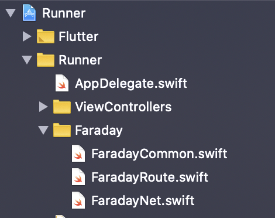
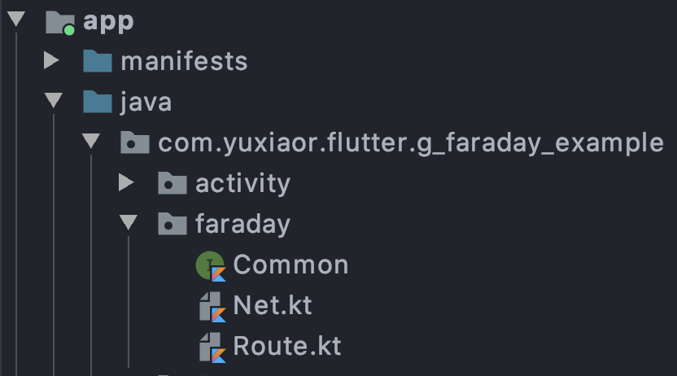
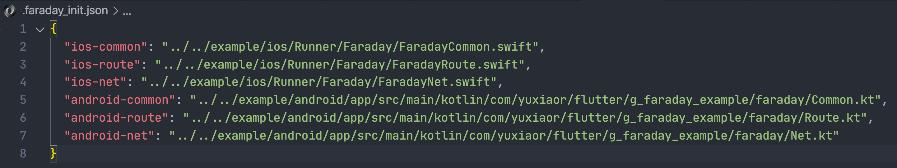

# Quick Start

## 0x00 前置条件准备

`faraday_cli` 会自动为原生项目生成一系列接口，开始对接之前请先手动添加以下几个空文件

ios: `FaradayCommon.swift`, `FaradayNet.swift`, `FaradayRoute.swift`



android: `Common.kt`, `Net.kt`, `Route.kt` 
> kotlin 文件请注意第一行包含 package 信息



然后在`flutter module`目录下新建`.faraday.json`,然后将上面6个文件的*绝对路径*添加进去，注意配置git忽略`.faraday.json`，因为每位开发成员的路径都不一致。




## 0x01 初始化所有文件

``` shell

faraday init

```
> 为上面几个文件生成默认实现

> 在 `lib/src/debug/debug.dart` 文件中生成 `debugMessage`


## 0x02 开始写第一个页面

### For iOS

### For Android
### For Flutter

混合项目中使用flutter开发的功能模块一般情况下相对独立。鉴于此faraday中定义了`Feature`的概念，每一组相似功能的独立页面都可以归属到一个`Feature`。 具体定义如下:
``` dart
// src/feature/feature.dart

abstract class Feature {
  Feature();
  // 功能描述描述
  String get description;

  // 功能名称
  String get name;

  // 作者
  String get author;

  // 注册feature中的所有页面
  Map<String, RouteFactory> get pageBuilders;
}

```

flutter端的开发从实现一个实现一个app开始, 例如我们实现一个 DemoApp 定义了以下页面

``` dart
  ...
  @override
  Map<String, RouteFactory> pageBuilders = {
    'demo_home': (settings) => CupertinoPageRoute(builder: (context) => Text('Demo page')),
    'demo_detail': (settings) => CupertinoPageRoute(builder: (context) => Text('Demo detail'))
  };

```
假设我们定义的 home 页面可以从`native`打开

``` dart

@common
static demoHome(String id) {
  
}

```